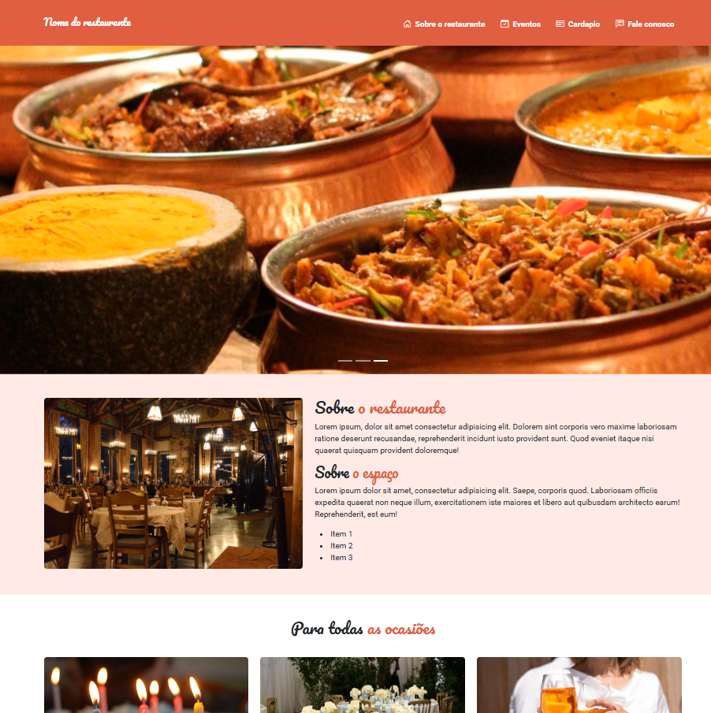

## Projeto 03 - Site para Restaurante 

### Sobre:
#### O projeto 03 foi desenvolvido pensando em um restaurante onde o site fala sobre o local mostra seu espaço e tipos de ocasiões e também colocamos um cardápio detalhado dos itens que estão disponiveis. 
#### Site é responsivo para todos tipos de dispositivos como: computadores, celulares, tablets
#### Para sua construção utilizamos Bootstrap para manipular o HTML e CSS & jQuery para algumas validações nos campos de contato.
##

Clique para ver 👇

    <a href="https://ebac-projeto-03.vercel.app/">
        </img>
    </a>

